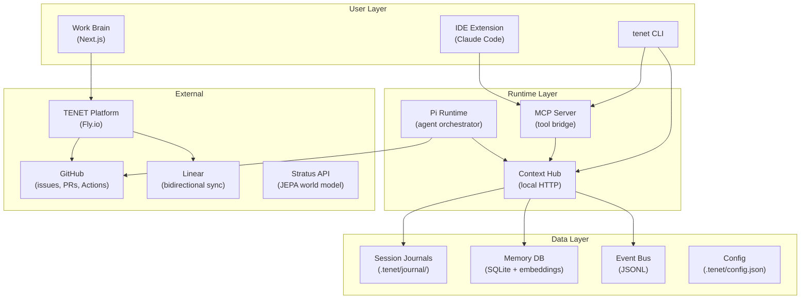
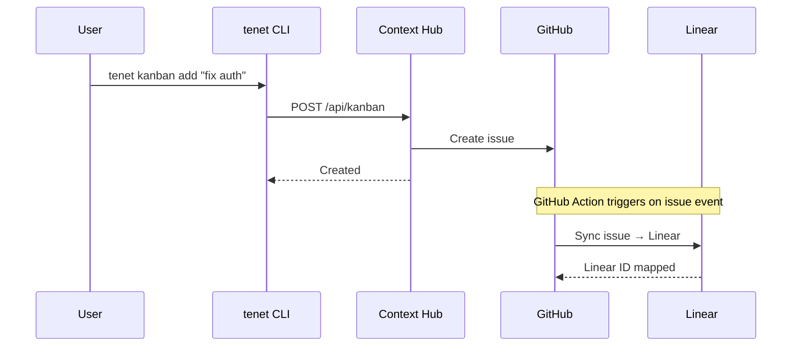

# /arch-diagram — Architecture & Sequence Diagrams

Generate publication-ready Mermaid diagrams for a TENET workspace. Output goes to `docs/diagrams/` in the target repo. Designed for:
- Cyber/security review documentation (Nishant / O&I)
- Infrastructure approval packages (Fly, Railway, Visa cloud)
- Developer onboarding and architecture handoffs

## On Invoke

### Step 1: Gather Context

Read the workspace to understand what to diagram:

```bash
cat .tenet/config.json
```

Read architecture docs if they exist:
```bash
cat knowledge/ARCHITECTURE.md 2>/dev/null
cat knowledge/TOPOLOGY.md 2>/dev/null
cat knowledge/VISION.md 2>/dev/null
```

For registered services, read their configs too:
```bash
# For each service in registered_services
cat <service_path>/.tenet/config.json 2>/dev/null
cat <service_path>/package.json 2>/dev/null
```

### Step 2: Determine Diagram Set

Based on context, generate the appropriate diagrams. Always generate at minimum:

1. **System Architecture** (`architecture.mmd`) — C4-style component diagram showing all services, their relationships, and external integrations
2. **Data Flow** (`data-flow.mmd`) — How data moves through the system (events, journals, API calls, webhooks)
3. **Deployment** (`deployment.mmd`) — Where things run (Fly, Vercel, local CLI, GitHub Actions)

If the workspace has specific patterns, also generate:

4. **Sequence: Build Cycle** (`seq-build.mmd`) — If build-agent pattern exists: issue → spec → eval → agent loop → PR → review → merge
5. **Sequence: Sync Flow** (`seq-sync.mmd`) — If Linear/GitHub sync exists: issue events → sync → bidirectional updates
6. **Sequence: Auth/Trust** (`seq-auth.mmd`) — If trust policy exists: agent auth → trust tier → merge policy
7. **Sequence: Red Team** (`seq-redteam.mmd`) — If red team recipes exist: spawn → scan → findings → report → issues

### Step 3: Generate Mermaid Files

Create `docs/diagrams/` directory and write each diagram as a `.mmd` file.

**Architecture diagram template:**


Adapt this to the actual workspace. Include only components that exist.

**Sequence diagram template:**


### Step 4: Generate Index

Create `docs/diagrams/README.md` listing all diagrams with descriptions:

```markdown
# Architecture Diagrams

Generated by `tenet skill_load("arch-diagram")` on YYYY-MM-DD.

| Diagram | Description | File |
|---------|-------------|------|
| System Architecture | C4-style component overview | [architecture.mmd](architecture.mmd) |
| Data Flow | Event, journal, and API data paths | [data-flow.mmd](data-flow.mmd) |
| Deployment | Infrastructure and hosting topology | [deployment.mmd](deployment.mmd) |

## Rendering

Mermaid renders natively on GitHub. For local preview:
- VS Code: Mermaid Preview extension
- CLI: `npx @mermaid-js/mermaid-cli -i architecture.mmd -o architecture.svg`
- Online: paste into mermaid.live
```

### Step 5: Journal

```
journal_write({
  type: "feature",
  title: "Generated architecture diagrams for <workspace>",
  summary: "Created N Mermaid diagrams in docs/diagrams/ covering architecture, data flow, deployment, and sequence flows.",
  files: ["docs/diagrams/architecture.mmd", "docs/diagrams/data-flow.mmd", ...],
  next: "Review diagrams, share with O&I / security team"
})
```

## Rules

- **Mermaid only** — no custom renderers, no image generation. Mermaid renders on GitHub, in VS Code, and in dashboards.
- **Reflect reality** — only diagram components that actually exist in the workspace. Read configs and code, don't guess.
- **Label everything** — every node gets a human-readable label and a brief description of what it does.
- **Security-conscious** — never include API keys, secrets, or internal URLs in diagrams. Use placeholder names.
- **Consistent style** — use `graph TB` for architecture, `sequenceDiagram` for flows, `graph LR` for data flow.
- **One file per diagram** — don't combine multiple diagram types into one file.

## Output

```
docs/diagrams/
  README.md           — Index of all diagrams
  architecture.mmd    — System architecture (always)
  data-flow.mmd       — Data flow paths (always)
  deployment.mmd      — Deployment topology (always)
  seq-build.mmd       — Build cycle sequence (if applicable)
  seq-sync.mmd        — Sync flow sequence (if applicable)
  seq-auth.mmd        — Auth/trust sequence (if applicable)
  seq-redteam.mmd     — Red team sequence (if applicable)
```
